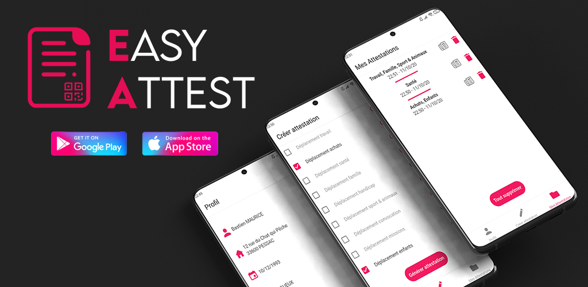

# EasyAttest

    

## Téléchargement

    

## Description  
Générez, stockez & partagez vos attestations de déplacement dérogatoire en un clic !  
  
Application mobile Android & iOS pour la génération d’attestations de déplacement dérogatoire durant le confinement en France. Attestation crée à partir du document officiel, évitant tout contact lors d’un contrôle afin de respecter les gestes barrière.   
  
EasyAttest, c’est simple :  

✔ Création de profil  
Vous pouvez créer puis gérer un profil pour chacun des membres de votre famille.

✔ Utilisation hors-ligne  
Générez sans vous soucier de votre connexion.

✔ Historique des attestations  
Affichez vos attestations selon la date et le profil.

✔ Protège votre vie privée  
Aucune donnée ne transite hors de votre téléphone ou sur le réseau. Vos données sont stockées en local au sein de votre smartphone et peuvent être supprimées à tout moment.

✔ Gratuit, sans pub & Open source  
Le code source de l’application est visible pour tous.

## Technos & Framework  
| Type  | Nom |
| ------------- | ------------- |
| Langage  | Typescript |
| Framework  | ReactNative & Expo  |

## Build  
  
### Génerer .apk
Disposez des certificats nécessaires (fichier .jks) dans le dossier './certif/android'.
1. Lancez la commande :  
`$ bash ./scripts/android/buildApk.sh`
2. Récuperez votre fichier .apk dans le dossier './build/android'.

### Génerer .ipa
Disposez des certificats nécessaires (fichier .p12 et .mobileprovision) dans le dossier './certif/ios'.
1. Lancez la commande :  
`$ bash ./scripts/ios/buildIpa.sh`
2. Récuperez votre fichier .ipa dans le dossier './build/ios'.

## Engagement de confidentialité
### Technologies utilisés
#### SQLite  
Cette techno permet de créer une base de données. Celle-ci est utilisé au sein de EasyAttest pour la gestion de profils et d’attestations au sein de l’application.  

#### Asyncstorage
Cette techno permet de stocker des couples <clé, valeur>. Celle-ci est utilisé au sein de EasyAttest pour le stockage et lecture de simple donnée, comme l’utilisateur connecté ou encore les paramètres de l’application.  

 

### Utilisation des données
Nous utilisons des technologies et framework assurant la totalité des données crée ou utilisé par EasyAttest, en local sur votre smartphone.  
Aucune donnée ne sort de votre smartphone par quelconque moyen, assurant un fonctionnement de l’application en mode avion.  

### Suppression des données
Vous pouvez à n’importe quel moment supprimer vos données en désinstallant EasyAttest de votre smartphone.

## Licence
Copyright (c) 2020 Bastien MAURICE

This project is licensed under the terms of the MIT [license](LICENSE).

